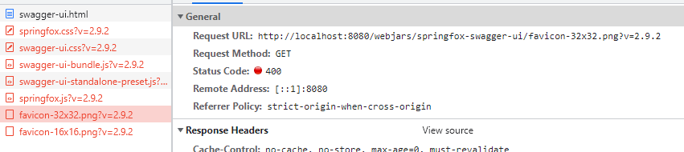

# 트러블 슈팅

## ISSUE 1 : AWS 빌드 중 Logback 관련 오류 발생
```bash
logging system failed to initialize using configuration from 'null'
```
- 원인 : Logback이 ./logs/info.log에 대한 쓰기 권한이 없음 
- 해결 : "sudo chmod 777 {dir or file}" 을 통해 쓰기 권한 부여하여 해결

<br>

## ISSUE 2 : AWS 인바이드 규칙에 IP 주소를 추가하였으나 접속 불가
- 원인 : 추가했던 IPv4 주소가 공유기에서 임시 발급한 사설 IP 주소였음을 확인 (IpConfig로 확인한 주소)
- 해결 : whatismyip 웹사이트를 통해 공용 IP 주소를 확인하여 수정

<br>

## ISSUE 3 : 캠핑장 삭제 시 DataIntegrityViolationException 발생
```bash
DataIntegrityViolationException could not execute statement
``` 
- 원인 : 캠핑장 삭제시 캠핑장 승인 테이블의 속성에 camp_id가 남아있어 무결성 문제로 예외 발생
- 해결 : CampAuth -> Camp 단방향 연관관계에서, CampAuth <-> Camp 양방향 연관관계로 변경 후, <br>
&nbsp;&nbsp;&nbsp;&nbsp;&nbsp;&nbsp;&nbsp;&nbsp;&nbsp;&nbsp;Camp 엔터티의 CampAuth List 필드에 cascade = CascadeType.Remove 속성 추가

<br>
 
## ISSUE 4 : GET 요청 시 아래와 같은 예외 발생
```bash
[http-nio-8080-exec-7] org.springframework.web.servlet.mvc.support.DefaultHandlerExceptionResolver Resolved 
[org.springdiaTypeNotSupportedException: Content type 'application/x-www-form-urlencoded;charset=UTF-8' not supported]
```
- 원인 : swagger에서 GET 요청 타입을 디폴트인 x-www-form-urlencoded로 전송
- 해결 : swagger config 설정을 아래와 같이 변동
```java
    @Bean
    public Docket api() {
        return new Docket(DocumentationType.SPRING_WEB)
                .host(host.substring(7))
                .consumes(getConsumeContentTypes())  // 요청 타입 추가
                .produces(getProduceContentTypes())  // 응답 타입 추가
                .apiInfo(apiInfo())
                .select()
                .apis(RequestHandlerSelectors.basePackage("com.camping101.beta"))
                .paths(PathSelectors.any())
                .build()
                .securityContexts(Arrays.asList(securityContext()))
                .securitySchemes(Arrays.asList(apiKey()));
    }

    private Set<String> getConsumeContentTypes() {
        Set<String> consumes = new HashSet<>();
        consumes.add("application/json;charset=UTF-8");
        return consumes;
    }

    private Set<String> getProduceContentTypes() {
        Set<String> produces = new HashSet<>();
        produces.add("application/json;charset=UTF-8");
        return produces;
    }
```

<br>

## ISSUE 5 : Swagger 요청 시 400 에러

- 원인 : "/webjars" 하위 경로에 대한 접근 허용 X 
- 해결 : swagger의 WebSecurity ignore 경로의 "/webjars/"를 "/webjars/**"로 변경 
```java
@Override
public void configure(WebSecurity web) {

    web.ignoring()
            .antMatchers("/h2-console/**","/swagger-ui.html", "/swagger-resources/**", "/webjars/**", "/v2/api-docs")
            .antMatchers("/css/**", "/vendor/**", "/js/**", "/images/**")
            .antMatchers(HttpMethod.OPTIONS, "/**");
}
```

<br>

## ISSUE 6 : Security ProviderNotFoundException for UsernamePasswordAuthenticationToken
- 원인 : CustomAuthenticationProvider의 supports 부분에 UsernamePasswordAuthenticationToken으로 설정하지 않았음
- 해결 : 아래와 같이 코드 수정하여 해결
```java
@Override
public boolean supports(Class<?> authentication) {
    return UsernamePasswordAuthenticationToken.class.isAssignableFrom(authentication);
}
```
